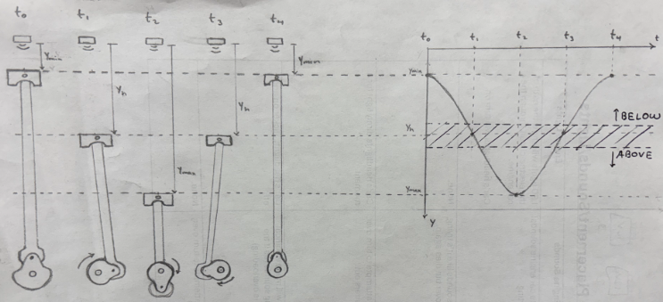

# Piston Interactive

## Overview

Source code for the piston interactive at Kidopolis, designed to teach children how different engine components work together. The exhibit features a crankshaft with adjustable throw, interchangeable connecting rods of varying lengths, and fixed piston heads on display with varying widths (representing different surface areas). By choosing a crankshaft throw, connecting rod, and piston head, visitors can manually rotate the crankshaft and create the oscillating piston motion. Two LED bar graphs beside the interactive display the torque and horsepower readings in real time, based on the selected components and measured RPM. A single ToF distance sensor paired with an ESP32 detects motion, computes RPMs using a center crossing algorithm, and calculates simplified torque and horsepower readings. These values are read by the QuinLED drivers and displayed on the two LED graphs accordingly.

## Hardware

- Microcontroller: ESP32-DevKitC-V4
- ToF Sensor: M5Stack's VL53L1X ToF Distance Unit. Found [here](https://shop.m5stack.com/products/time-of-flight-distance-unit-vl53l1x?srsltid=AfmBOoprDGgPCZlY4ets509p4m7cXj-nKKdMHRDG5hY20O5jZdbu7gsj)
- LED Drivers: 2 x [QuinLED Dig Uno](https://quinled.info/quinled-dig-uno/) drivers
- LED Strips: 10 x 12V WS2815 LED Strips

## ESP32 Software Architecture

### Overview

The main esp32's source code contains classes that handle proper ToF sensor data acquisition and filtering, motion tracking logic, engine parameter calculations (rpms, torque, and horsepower), and create corresponding PWM signal for the QuinLED driver board. Below is an overview of each class in the sketch and the role it plays in this project.

### `RingWindow` class

Purpose: a lightweight ring window (a.k.a circular buffer) data structure used to hold the last N samples and provides the min, max, and average of that latest window

### `ToFSensor` Class

Purpose: The interface for the VL53L1X sensor, measuring piston head position

Key Methods:

1. `configure()`: sensor initialization with ROI and timing settings (see [Polulu's](https://github.com/pololu/vl53l1x-arduino) library for this sensor for more information on config settings)
   - note: in the future I would like to add auto sensor calibration based on scene/environment but these settings worked alright
2. `read()`: position reading with EMA smoothing filter
3. `ready()`: non-blocking data availability check

Features: built-in timeout handling, validity range checking, exponential moving average filter for raw position filtering

### `MotionTracker` Class

Purpose: motion detection and RPM calculation from position data using center-crossing algorithm

Key Methods:

1. `update()`: motion detection, throw calculation, zero-crossing detection logic, and motion timeout reset (more on these below)
2. `decayRPM()`: RPM decaying function when motion of crankshaft stops to simulate engine slowing down

Key Features:

- **Motion Detection**: Simple calculation of change in position `d`, only move forward if the absolute value of this change is greater than a pre-specified constant `d > config::MIN_MOTION_DELTA_MM`
- **Crankshaft Throw Calculation**: Once the ring windows for min/max are updated, the throw is just (min-max)/2, if this calculated throw passes some validity checks, we update crankshaftThrow and set the throwValid flag to move on to center crossing
- **Center Crossing RPM calculation**:

This is where the fun begins, the filtered distance readings form a clean-ish oscillating wave as the piston moves (drawn below). By taking the midpoint between the minimum and maximum readings, calculated with (min + max)/2, we establish a logical "center" of the pistons travvel. This center value acts as a checkpoint that tells us when the piston crosses from one side of its motion to the other. A small state machine, using the `Edge` enum (`ABOVE`, `BELOW`, `UNKNOWN`) tracks whether the current reading is above or below that threshold. Adding some hysteresis to these position vs. center checks prevents rapid flickering between states and results in more stable transitions.

A timestamp is created whenever a center crossing event occurs (when we transition from `ABOVE` to `BELOW` or vice versa), so that on the next crossing event we compare the current time (latest transition) to the previous crossing event timestamp, to obtain the **half-period** of the oscillation. Using that half period, the RPMs are calculated with: `rpm = 60,000 / (half_period) * 2`. Adding this to a ring window yields a simple but reliable RPM estimate from a single sensor!

