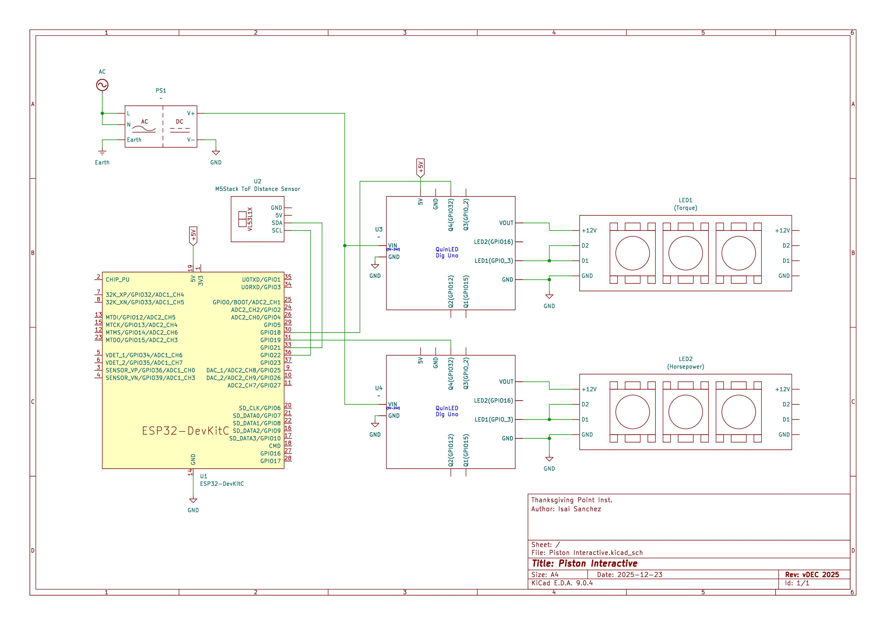
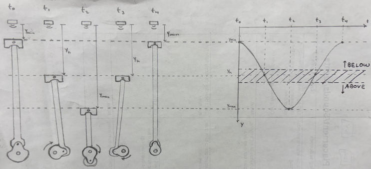

# Piston Interactive

https://github.com/user-attachments/assets/111e5102-65e5-45da-a01b-91ffcd15ad6e

## Overview

Source code for the piston interactive at Kidopolis, designed to teach children how different engine components work together. The exhibit features a crankshaft with adjustable throw, interchangeable connecting rods of varying lengths, and fixed piston heads on display with varying widths (representing different surface areas). By choosing a crankshaft throw, connecting rod, and piston head, visitors can manually rotate the crankshaft and create the oscillating piston motion. Two LED bar graphs beside the interactive display the torque and horsepower readings in real time, based on the selected components and measured RPM. A single ToF distance sensor paired with an ESP32 detects motion, computes RPMs using a center crossing algorithm, and calculates simplified torque and horsepower readings. These values are read by the QuinLED drivers and displayed on the two LED graphs accordingly.

## Hardware

- Microcontroller: ESP32-DevKitC-V4
- ToF Sensor: M5Stack's VL53L1X ToF Distance Unit. Found [here](https://shop.m5stack.com/products/time-of-flight-distance-unit-vl53l1x?srsltid=AfmBOoprDGgPCZlY4ets509p4m7cXj-nKKdMHRDG5hY20O5jZdbu7gsj)
- LED Drivers: 2 x [QuinLED Dig Uno](https://quinled.info/quinled-dig-uno/) drivers
- LED Strips: 10 x 12V WS2815 LED Strips

There are three boards per exhibit: one ESP32 running `piston-dynamics/`, and two QuinLED Dig Unos both running `torque-hp-led-driver/` — one for the torque bar, one for horsepower.

## Pinout

### `piston-dynamics` — ESP32-DevKitC-V4

| GPIO | Direction | Connects to                  | Constant                 |
| ---- | --------- | ---------------------------- | ------------------------ |
| 21   | I2C SDA   | VL53L1X SDA (address `0x29`) | ESP32 core default       |
| 22   | I2C SCL   | VL53L1X SCL                  | ESP32 core default       |
| 18   | PWM out   | Torque QuinLED, GPIO 32      | `config::TORQUE_LED_PIN` |
| 19   | PWM out   | Horsepower QuinLED, GPIO 32  | `config::HP_LED_PIN`     |

Both PWM outputs run at 5 kHz with 8-bit resolution (`config::PWM_FREQ_HZ`, `config::PWM_RES_BITS`).

> **Note:** the I2C pins are the ESP32 Arduino core's defaults, because the sketch calls `Wire.begin()` with no arguments. They are the only pins in this table not named in `Config.h`.

### `torque-hp-led-driver` — QuinLED Dig Uno (x2, identical firmware)

| GPIO | Direction               | Connects to                                                | Constant                |
| ---- | ----------------------- | ---------------------------------------------------------- | ----------------------- |
| 32   | PWM in (`INPUT_PULLUP`) | ESP32 GPIO 18 (torque board) or GPIO 19 (horsepower board) | `config::PWM_INPUT_PIN` |
| 3    | Data out                | WS2815 `DIN`                                               | `config::LED_DATA_PIN`  |

## Wiring Diagram



## Deployment & Maintenance

Everything needed to put firmware on a unit, and to work out what a misbehaving exhibit is telling you.

### Before you flash

Two constants decide whether a build is right for the unit in front of you. Neither is obvious, and both have shipped wrong before:

| Check          | File                                | Why it matters                                              |
| -------------- | ----------------------------------- | ----------------------------------------------------------- |
| `DISPLAY_TYPE` | `piston-dynamics/src/Config.h`      | Selects the piston-size variant (see below)                 |
| `NUM_LEDS`     | `torque-hp-led-driver/src/Config.h` | 47 in the exhibit; often left at a smaller test bench value |

Everything else takes care of itself: platform and library versions are pinned in each `sketch.yaml` profile, so a plain `arduino-cli compile` reproduces the build regardless of what is installed globally. `default_port` is deliberately not committed - pass the port flag `-p` on upload.

### The three units

One codebase, three exhibits, a single constant apart:

```cpp
// piston-dynamics/src/Config.h
constexpr PistonSize DISPLAY_TYPE = PistonSize::SMALL;
```

| Unit          | `DISPLAY_TYPE`       | Max PWM duty |
| ------------- | -------------------- | ------------ |
| Small piston  | `PistonSize::SMALL`  | 190          |
| Medium piston | `PistonSize::MEDIUM` | 220          |
| Large piston  | `PistonSize::LARGE`  | 255          |

**The duty ceiling differs on purpose.** It makes the bars reach visibly different heights across the three exhibits at the same RPM. Not physically accurate - the educational payoff of seeing them differ is worth more.

The `torque-hp-led-driver` firmware is identical on every QuinLED; there is no variant on that side.

Tag at the moment of flashing. The variant is not reported at runtime, so the tag is the only record of what a given unit is running:

```bash
git tag -a deploy/2026-08-17-small -m "flashed to small piston unit"
git push --tags
```

### What working looks like

| When                    | The bars do this                                          |
| ----------------------- | --------------------------------------------------------- |
| At power-on             | Breathe amber across the whole strip, about 4 s per cycle |
| Crank turning           | Go solid green, height tracking torque and horsepower     |
| ~5 s after motion stops | Return to amber breathing                                 |

**Amber breathing is healthy.** It means the QuinLEDs are powered, programmed, and fine - they are simply not receiving a signal.

Neither board ever halts. A failed sensor retries every 5 seconds; a stalled main loop is rebooted by a watchdog within 5 seconds.

### When something is wrong

Serial is **115200** on both boards. `piston-dynamics` prints a CSV line per sensor read, plottable in the Arduino IDE's Serial Plotter tool:

```
Pos(mm),Throw(mm),RPM,Torque,HP
```

A frozen `Pos` column means the sensor has stopped returning good reads. `Attempting recovery...`, `Recovery OK` and `Recovery failed` bracket each retry attempt.

| Symptom                                       | Likely cause                                    | Check                                                                                             |
| --------------------------------------------- | ----------------------------------------------- | ------------------------------------------------------------------------------------------------- |
| Both bars breathe, never respond to the crank | No PWM reaching the QuinLEDs                    | Is the ESP32 powered? GPIO 18 and 19 wired to each QuinLED's GPIO 32?                             |
| One bar breathes, the other tracks            | That board's signal wire                        | GPIO 32 on the affected QuinLED                                                                   |
| Bars dark, no breathing at all                | Power, or the LED data line                     | 12 V to the strips, 5 V to the QuinLED, GPIO 3 to strip `DIN`                                     |
| Readings jump around or sit at zero           | ToF sensor blocked, misaligned, or out of range | Clean the window; the piston head must be 20–4000 mm away and inside the narrow 6x6 field of view |
| `Attempting recovery...` on repeat            | I2C to the sensor is failing                    | Reseat the sensor's connector; confirm 3.3 V                                                      |
| Reboots every few seconds                     | Watchdog fired - the main loop stalled          | The serial backtrace names the task that hung                                                     |
| Serial silent but LEDs behave normally        | Release build (`DEBUG_LEVEL=0`)                 | Not a fault                                                                                       |

### Quirks worth knowing

Behaviour that looks like a fault but isn't:

- **The bar ignores small changes.** It only redraws once the reading moves by 2 LEDs. Nudging the crank slightly will not move it.
- **RPM coasts down rather than dropping.** When the crank stops, the reading decays gradually to imitate an engine spinning down, so the bars keep falling for a second or two after motion ends.
- **Sensor alignment is fussy.** The field of view is deliberately narrowed to 6x6 for accuracy, which buys precision at the cost of tolerance - bumping the sensor mount matters more than it looks like it should.

<!-- TODO: add field observations from the deployed exhibit here — things
     noticed on site that no one would guess from the code. -->

## Architecture

Real logic lives in each sketch's `src/` directory; the `.ino` files handle bring-up and hand off to those classes.

### `piston-dynamics`

Reads the ToF sensor, tracks piston motion, derives RPM, computes torque and horsepower, and emits two PWM signals for the QuinLED drivers.

- **`App`** - owns every subsystem and runs the finite state machine (`INIT`, `IDLE`, `TRACKING`, `ERROR_RECOVERY`) in `loopOnce()`. Polls the sensor on a timer, feeds the tracker, computes outputs, and drops into recovery when the health monitor reports a problem.
- **`ToFSensor`** - the interface to the VL53L1X. `init()` applies the ROI and timing configuration and is safe to call again to recover a wedged sensor; `ready()` is a non-blocking data check; `read(float &pos)` returns a validity-checked, EMA-smoothed position. See [Pololu's library](https://github.com/pololu/vl53l1x-arduino) for the configuration registers.
- **`MotionTracker`** - motion detection, crankshaft throw measurement, and RPM estimation by center crossing. `update()` does the per-sample work, `decayRPM()` bleeds RPM off when the crank stops so the engine appears to slow down. Detailed below.
- **`EngineModel`** - stateless helper turning throw and RPM into a simplified torque and horsepower pair via `compute()`.
- **`LedOutput`** - sets up the two LEDC PWM channels and maps a float reading onto a duty cycle, applying the per-variant duty ceiling from **Deployment**.
- **`Health`** - counts consecutive bad reads, flags the system unhealthy past `MAX_SENSOR_ERRORS`, and gates recovery attempts on a timer so retries are spaced out.
- **`RingWindow`** - fixed-size circular buffer template holding the last N samples, with min, max, average and median. No dynamic allocation; capacity is a template parameter.

#### How the RPM estimate works

The filtered distance readings form a clean-ish oscillating wave as the piston moves. By taking the midpoint between the minimum and maximum readings, calculated with `(min + max) / 2`, we establish a logical "center" of the piston's travel. That center acts as a checkpoint telling us when the piston crosses from one side of its motion to the other. A small state machine using the `Edge` enum (`ABOVE`, `BELOW`, `UNKNOWN`) tracks whether the current reading sits above or below the threshold, and a hysteresis band around the center prevents rapid flickering between states.

A timestamp is recorded on every center crossing, so the next crossing gives us the **half-period** of the oscillation. From that half period the RPM is `rpm = 60000 / (half_period * 2)`. Feeding those values through a ring window yields a simple but reliable RPM estimate from a single sensor.

Motion itself is detected by change in position: the tracker only advances when the absolute change exceeds `config::MIN_MOTION_DELTA_MM`. Throw is `(max - min) / 2`, and once it passes validity checks the tracker sets `is_throw_valid_` and begins center-crossing detection.



### `torque-hp-led-driver`

Measures the incoming PWM duty cycle and renders it as a bar on a WS2815 strip. Both QuinLEDs run this identically.

- **`PwmReader`** - measures duty cycle from the PWM input using a pin-change ISR. Owns the interrupt registration, the `volatile` pulse and period timestamps, and the critical section that snapshots them, so nothing outside the class can read that state unsafely. `read(float &duty_cycle_pct)` returns a running average, or `false` when there is no fresh, valid measurement.
- **`BarDisplay`** - owns the pixel buffer and the FastLED controller. `update(count, is_idling)` renders one frame: a solid green run of `count` LEDs when active, or the whole strip breathing in amber when idle. The animation phase advances inside `update()`, once per frame.
- **`RingWindow`** - the same buffer template as above, used by `PwmReader` to smooth the duty cycle.

> **Note:** `RingWindow.h` is duplicated between the two sketches rather than shared. `arduino-cli` compiles each sketch in isolation and can only include from that sketch's own folder, so a fix to one copy needs applying to the other.
